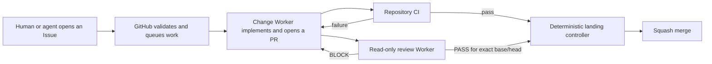

# Agent Automation Control Plane

This is a Windows-hosted automation system for GitHub.com. It turns Issues, pull requests, CI failures, and review results into queued work for local AI agents.

“Agent-neutral” means the controller can use DeepSeek Harness, Codex, OpenCode, Claude Code, or another Worker through one interface.

Portable dry-run planning and CI validation run on Windows, Linux, and macOS. Managed installation and service execution are currently implemented only for Windows x64.

Change, review, and maintenance Workers can be stopped, replaced, or scaled independently.

Workers on the same Windows account and machine remain in one security trust domain.

Separate processes, work directories, credentials, and queues provide lifecycle and fault isolation—not a security boundary.

Use separate hosts or operating-system accounts when the change Worker must not be able to affect the reviewer.

## Five-minute overview



Nothing polls a model. GitHub events wake idle self-hosted runners. Deterministic controller code validates live repository state before starting a Worker or merging a pull request.

Agents do not need individual GitHub accounts. The host controller owns privileged GitHub operations, while model processes receive no Actions token.

A minimal Issue looks like this:

````markdown
Implement a dark-mode toggle and cover it with tests.

Acceptance criteria:
- The saved preference survives a restart.
- Existing light-mode behavior remains unchanged.

<!-- agent-work:v2 -->
```json
{
  "version": 2,
  "dispatch": "ready",
  "workflow": "default",
  "dependsOn": []
}
```
````

Opening or editing that Issue queues the repository's configured change Worker. The Worker creates a branch and pull request. CI failures and blocking reviews return to the same change queue.

A pull request merges only after the configured CI checks and the controller-owned `agent/review` CheckRun pass for its current exact head pair.

## Prerequisites

- GitHub.com. GitHub Enterprise Server is not supported because the controller depends on `job.workflow_repository` and `job.workflow_sha`, which GHES does not expose with the required semantics.
- PowerShell 7, Git, GitHub CLI, and Node.js 22 or newer for planning and validation.
- A Windows x64 host for managed installation and execution. Linux and macOS currently support plan generation, not service installation.
- GitHub Actions Runner 2.334.0 or newer. The example configuration pins 2.336.0.
- Repository administration rights for runner registration, Actions variables, and branch protection.
- Existing authentication for every selected Agent Adapter. Provider keys stay outside this repository.

`job.workflow_repository` and `job.workflow_sha` are the source of truth for checking out the reusable controller. Do not replace them with caller-supplied repository or revision inputs.

## Quick start

Start from an audited controller commit and keep the machine configuration outside the checkout:

```powershell
$controller = 'D:\src\dsh-agent-automation'
$target = 'D:\src\target-repository'
$config = 'F:\dsh-agent-automation-state\agent-config.json'

New-Item -ItemType Directory -Force (Split-Path -Parent $config) | Out-Null
Copy-Item "$controller\config.minimal.json" $config

pwsh -NoProfile -File "$controller\scripts\bootstrap-repository.ps1" `
  -TargetCheckout $target `
  -ControllerRepository owner/dsh-agent-automation `
  -ControllerSha 0123456789abcdef0123456789abcdef01234567 `
  -CiWorkflowNamesJson '["CI"]' `
  -UpstreamRepository upstream-owner/upstream-repository `
  -DryRun

pwsh -NoProfile -File "$controller\scripts\doctor.ps1" -Configuration $config -Explain -DryRun
pwsh -NoProfile -File "$controller\scripts\install.ps1" -Configuration $config -DryRun
```

Inspect both dry runs, then repeat without `-DryRun`.

Every dry run also emits one compact, versioned JSON line. Installation and doctor use the `AUTOMATION_INSTALLATION_PLAN_JSON=` prefix; target bootstrap uses `AUTOMATION_BOOTSTRAP_PLAN_JSON=`.

The installation plan records the target platform, paths, runner artifact and checksum, normalized labels, services, repository variables, and branch-protection requirements. Add the corresponding runner artifact under `operations.runner.artifacts`, then pass `-TargetPlatform linux-x64`, `linux-arm64`, `macos-x64`, or `macos-arm64` to inspect another platform without touching that host or GitHub.

A non-dry install rejects a target platform that differs from the current host. Non-Windows execution fails explicitly because systemd and launchd installers have not been implemented.

Before starting a Worker, the installer verifies the GitHub identity, runner archive checksum, runtime snapshot, target workflows, repository variables, and branch protection.

`ControllerSha` must be a published lowercase 40-character SHA that remains reachable from the controller's default branch.

After squash or rebase publication, verify that the published commit tree matches the reviewed pull-request head tree before pinning the published commit.

The complete install, migration, failure-injection, and removal procedures are in the [Windows operations guide](docs/operations.md).

## How work moves

### Issue work

The `agent-work:v2` declaration is routing data, not the task description. Issue title, prose, and acceptance criteria remain the human-readable source of work.

- Required fields: `version`, `dispatch`, `workflow`, and `dependsOn`.
- `dispatch` is `ready` or `hold`; `dispatch: "hold"` does not start a Worker.
- `workflow` selects a workflow from the trusted repository Profile; `default` selects the bundled GitHub pull-request cycle.
- `dependsOn` contains unique open Issue numbers. Work waits until they close.
- Optional `branch` defaults to `agent/issue-<number>`.

Malformed declarations and unknown fields fail closed. Unsafe branch names and untrusted authors fail closed too.

Do not put commands, credentials, Agent names, or implementation instructions inside the routing object.

### Pull-request review and repair

A same-repository, non-draft pull request queues the configured review Worker. The Worker receives a controller-created read-only checkout and guidance from the verified base revision.

The Worker cannot execute pull-request code or inherit GitHub credentials.

PASS and BLOCK bind the exact base and head SHAs. A changed head makes the result stale. BLOCK creates one idempotent repair WorkRequest for the change role. When that Worker advances the head, the Controller dispatches the next review with the same Profile workflow identity; the resulting CheckRun carries that identity so landing cannot silently fall back to another workflow.

Failed CI and an explicit trusted rework request enter the same queue after independent GitHub-state validation.

Landing is model-free. It requires:

1. The current pull request is open, non-draft, and mergeable.
2. Every configured required check has passed.
3. The GitHub Actions-owned `agent/review` CheckRun passed on the exact head.
4. The CheckRun's workflow run proves the exact repository, base, head, controller workflow path, and pinned controller SHA.

Comments, labels, and legacy commit statuses are audit projections; none can authorize a merge.

### Profiles, Governor, and infrastructure recovery

The trusted repository Profile under `.github/agent-automation/profiles/` owns product workflow stages, procedures, coordination, checks, and merge behavior. The Controller keeps exact revision validation, independent review, capability enforcement, bounded budgets, and merge safety fixed.

Infrastructure failures use a separate Controller Maintenance Profile. One stable `FaultRecord v1` owns deterministic recovery, the finite maintenance Worker order, at most one repair pull request per epoch, independent review and CI, one fault-bound release, runtime verification, and resumption of the original WorkRequests. Child failures remain attempts of that root fault; they cannot create recursive fault Issues. Exhaustion opens a circuit until a verifiable state revision changes.

### Supervision and recovery

Optional repository supervision uses a read-only Worker to propose evidence-backed maintenance actions.

Before every mutation, the controller validates each path, changed line, excerpt, dependency, and live target state.

The controller contains no project-specific ordering or product policy.

Hosted reconciliation closes deferred landing states and recovers bounded infrastructure failures.

A watchdog detects Agent jobs that remain queued too long. Local replicas record heartbeats, and a daily canary performs one real Adapter readiness check.

## Choosing an Agent

`operations.roles` is the only Agent-selection table. Assign one named Worker to `change`, one independently isolated Worker to `review`, and a finite ordered Worker list to `maintenance`. Repository mappings contain repository CI data only. Target workflows and the GitHub protocol do not change when a role changes Worker.

Bundled Adapters:

- `dsh-web`: DeepSeek Harness sessions and its installed GitHub-work plugin.
- `codex-app`: visible ChatGPT Desktop review tasks.
- `opencode-cli`: OpenCode change or hard-read-only review mode.
- `claude-code-cli`: Claude Code change or hard-read-only review mode.
- `command-json`: a generic change-only subprocess protocol.

A review Worker must declare `github-pr-review`, `github-repository-supervision`, and controller-verifiable hard-read-only execution. Prompt text alone is not isolation.

The example DSH Worker uses full change permissions and is therefore change-only. Codex, OpenCode, and Claude Code use dedicated reviewer isolation.

Set `DSH_AGENT_CONFIG` to a machine-local JSON file based on [config.minimal.json](config.minimal.json). The [configuration reference](docs/configuration-reference.md) lists every optional field and built-in default. Each Worker declares only its Adapter settings; its role and capabilities are derived from the one role table.

Review comments render that controller-owned Worker metadata instead of hardcoding a model in presentation code.

Change, review, and maintenance concurrency is configured independently with `operations.roles.<role>.replicas`; maintenance remains fixed to one replica by the recovery policy.

GitHub may run different subjects in parallel. Workflow concurrency keys serialize duplicate work for one Issue or pull request.

## Adapter interface

New Agents implement the same invocation and terminal receipt:

```json
{
  "taskId": "stable-idempotency-key",
  "cwd": "X:\\isolated-checkout",
  "title": "visible local task title",
  "prompt": "adapter input",
  "requiredSkill": "optional capability",
  "timeoutMs": 10800000
}
```

```json
{
  "sessionId": "visible-or-external-session-id",
  "outcome": "completed|blocked|superseded|timed-out|failed",
  "detail": "short machine-readable detail",
  "output": "optional role result"
}
```

Unknown Workers, Adapters, outcomes, capabilities, or malformed results fail closed. See [architecture](docs/architecture.md) for module responsibilities and termination behavior.

## Runtime and trust boundaries

The three runner roles use separate registrations, work directories, queues, and host services. The plan derives standard GitHub labels from the target platform; role configuration contains only custom routing labels. A Windows x64 plan produces:

- `[self-hosted, Windows, X64, agent-reviewer]`
- `[self-hosted, Windows, X64, agent-change]`
- `[self-hosted, Windows, X64, agent-maintenance]`

Stopping any role leaves the others operational. On Windows, every managed task starts through one Adapter-neutral Role Process Host.

A private desktop prevents descendant command-line windows from appearing on the user's desktop. A Job Object provides process-tree termination.

The Windows installer compiles the reviewed C# host source with the local .NET Framework compiler. The immutable runtime identity binds the source hashes and compiler hash, while the install manifest separately verifies the generated executable hash; no generated executable is committed.

This is lifecycle containment only. The roles still share the host filesystem, network, kernel, account privileges, and GitHub identity.

For a real security boundary, put review and change Workers on separate machines or separately administered operating-system identities and credentials.

## Development

Run:

```powershell
npm test
npm run typecheck
pwsh -NoProfile -File scripts/test-operations.ps1
pwsh -NoProfile -File scripts/test-installation-plan.ps1
pwsh -NoProfile -File scripts/test-bootstrap-repository.ps1
```

The portable plan suite runs on Windows and Linux in CI and covers Linux, macOS, and Windows plan values. The Windows operations suite includes Pester coverage for branch-protection and install/remove safety contracts plus an OS canary for the private desktop and Job Object process tree.

See [CONTRIBUTING.md](CONTRIBUTING.md) and [SECURITY.md](SECURITY.md).
