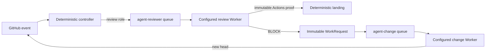

# Architecture

## Modules

### Automation Domain

This Module owns WorkRequest validation, exact revision identity, idempotency, review verdicts, repair postconditions, and landing eligibility. It contains no model-provider logic. Its Interface uses roles (`change` and `review`) rather than product names.

The WorkRequest is the durable Seam between roles. Its subject is either one Issue or one pull request; the request kind fixes which subject is valid. A producer ends after GitHub accepts the event. A consumer starts in a separate workflow run and independently revalidates the live pull request.

### Agent Worker

This Module owns the stable invocation and terminal receipt Interface. Its Depth comes from hiding provider sessions, process protocols, model configuration, and local UI persistence behind one small call. Controllers know a worker id and role; they do not know how the Implementation starts or observes a session.

### Agent Adapters

Adapters translate the Worker Interface to one runtime:

- `dsh-web` uses the local DeepSeek Harness Web Host. Change work is a structured WorkRequest sent through a controller-installed, user-explicit Cordis Skill; the Adapter verifies the Skill is present before prompting and does not carry the role procedure itself. The Adapter preallocates the visible session from the immutable task id and treats the durable prompt rpc id as the admission receipt, so transport recovery cannot create a second turn. A hidden final result reports `completed` or `blocked`; it does not authorize GitHub changes, and the Automation Domain revalidates the live postcondition.
- `codex-app` creates and observes a visible ChatGPT Desktop task.
- `command-json` supports any executable that accepts JSON stdin and returns a JSON receipt.

Adding an Adapter is local: the Automation Domain and target workflows do not change.

### Repository Gateway

Controller scripts validate and publish GitHub state using the host controller identity or the job-scoped Actions identity. Workers do not require individual GitHub accounts. Current change-role prompts may use the shared host transport to commit and publish; this is an Implementation detail of the trusted local change environment, not part of the Worker Interface.

### Role Runners

GitHub runner labels are the scheduling Interface. `agent-reviewer` and `agent-change` use different registrations, processes, work directories, concurrency groups, and task timeouts. They may run on different machines without controller changes.

## Event flow

There is no direct Agent-to-Agent call. GitHub records the handoff before the producing job terminates.

## Termination boundaries

- A Worker run terminates only with `completed`, `blocked`, `superseded`, `timed-out`, or `failed`.
- Landing accepts only the controller-created `codex/review` CheckRun on the exact PR head. Its GitHub Actions app, details URL, exact `pull_request_target` run, PR base/head, and `referenced_workflows` path `${controllerRepository}/${workflowPath}@${controllerSha}` plus SHA bind it to the trusted controller. Comments and commit statuses are not landing authority.
- The review Adapter starts each turn in an empty controller-created directory and exposes the head checkout only as read-only data. Repository instructions come from the verified base revision; head-authored instructions cannot become reviewer policy.
- A controller accepts `completed` only after independently checking the role postcondition, such as a new pull request head, an exact-pair verdict, or an explicit same-head rereview request.
- Workflows select only the immutable `change` or `review` role. The local controller resolves its worker from the one configured repository mapping and rejects any missing, duplicate, or unknown mapping before invoking an adapter.
- Workflow and local process timeouts are finite. Cancellation does not become success.
- A review BLOCK terminates the review job after publishing a WorkRequest. It does not wait for change work.
- A default-branch advance updates each behind same-repository pull request with its expected head SHA, waits for GitHub to expose the new exact pair, and explicitly dispatches its review because job-token writes do not recurse into workflows. Stacked and fork pull requests are not modified.
- A stopped role runner leaves its matching GitHub job queued. Other runner labels continue to accept work.
- Landing terminates with merged, deferred for checks, stale revision, blocked, or failed. It rereads the exact-head GitHub Actions CI aggregate and trusted review immediately before merging and never reuses a verdict from another base/head pair. Installation and online diagnosis independently enforce strict app-bound branch protection because a workflow token cannot read repository Administration settings.
- DSH Web RPC retries only bounded transient transport failures with the same RPC id and the original visible session. A cancellation signal cancels that session. Exhausted failures retain their transient or terminal classification in the durable failed handoff; no controller waits indefinitely for a disconnected local host.
- The DSH work bundle contributes only `github-issue-work` and `github-pr-repair` as user-explicit, model-hidden runtime Skills. The ordinary Web profile owns agent creation, model selection, durable events, tools, and presentation. A missing Skill fails before the first model call; ACP is not a substitute because its sessions are automation transport rather than Web UI sessions.
- A CI repair that proves the same failure on the default branch terminates as `blocked` only after its Skill creates or reuses an open same-repository Issue with the exact baseline marker and `agent/dsh` label. The controller verifies that Issue and records `automation/ci-baseline`; the ordinary Issue queue performs the fix. Other valid blocked results become terminal `automation/repair-blocked` state and do not enter automatic recovery. A default-branch advance clears both terminal projections before requesting a new exact-pair review.
- A completed failed or cancelled top-level Agent Issues, Agent PR Rework, or Agent PR CI Repair run wakes one model-free recovery workflow. Recovery verifies the recorded reusable controller reference, revalidates the current Issue or pull request head, and records at most three exact-subject retry attempts. The cap is a visible `agent/dsh-failed` dead-letter; labels and comments are audit state and cannot authorize recovery.
- Issue implementation uses the trusted Issue's validated branch declaration, or `agent/issue-<number>` for a bug without one. The controller rejects the protected default branch and any declared branch already used by another open pull request. Marker authorship is audit data used only to avoid overwriting another actor's comment; it never authorizes landing or privileged work.
- A valid blocked Issue receipt records `agent/dsh-blocked`, removes `agent/dsh`, and ends without workflow failure or automatic recovery. A later owner decision can explicitly relabel the Issue; default-branch backlog dispatch skips the blocked projection.

The remaining common failure domains are GitHub, the network, and any machine that hosts more than one runner. Moving a runner to another host changes only its labels and machine-local worker configuration.
