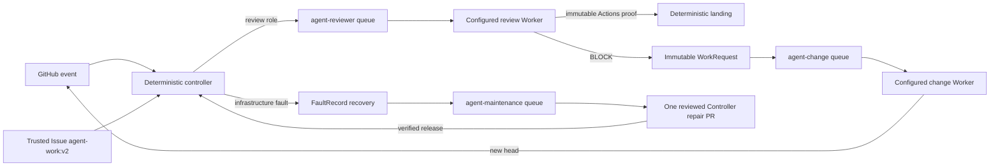

# Architecture

## Modules

### Automation Domain

This Module owns Workflow Definition and WorkRequest validation, exact revision identity, idempotency, review verdicts, repair postconditions, and landing eligibility. It contains no model-provider logic. A trusted Issue selects a Profile workflow through one strict `agent-work:v2` JSON block; the trusted Profile selects Stage roles and registered procedures, while the Issue prose remains the work specification.

The WorkRequest is the durable Seam between the Governor and a Worker Adapter. It binds `profileId`, `workflowId`, `stageId`, `definitionHash`, role, subject, coordination key, and exact revision without carrying commands or model selection. An Issue declaration and trusted Profile hash form its request identity, so formatting changes are idempotent and routing or Profile changes produce a new request. A producer ends after GitHub accepts the event. A consumer starts in a separate workflow run and independently reloads the Profile from the trusted revision before validating the live Issue or pull request.

### Agent Worker

This Module owns the stable invocation and terminal receipt Interface. Its Depth comes from hiding provider sessions, process protocols, model configuration, and local UI persistence behind one small call. Controllers know a worker id and role; they do not know how the Implementation starts or observes a session.

### Agent Adapters

Adapters translate the Worker Interface to one runtime:

- `dsh-web` uses the local DeepSeek Harness Web Host. Change work is a structured WorkRequest sent through a controller-installed, user-explicit Cordis Skill; the Adapter verifies the Skill is present before prompting and does not carry the role procedure itself. The Adapter preallocates the visible session from the immutable task id and treats the durable prompt rpc id as the admission receipt, so transport recovery cannot create a second turn. A hidden final result reports `completed` or `blocked`; it does not authorize GitHub changes, and the Automation Domain revalidates the live postcondition.
- `codex-app` starts a visible ChatGPT Desktop turn immediately, then attempts its stable review title, project location, and retention after that turn completes. App Server task metadata is not mutated while its rollout writer is active, and a stale task that cannot be archived does not discard a completed review result.
- `opencode-cli` runs either role through OpenCode's non-interactive JSON event stream and a temporary native Skill.
- `claude-code-cli` runs either role through Claude Code's non-interactive JSON event stream. Trusted change work receives a temporary native plugin and full permissions; review receives the same controller Skill with only the neutral project setting source and a read-only tool set.
- `command-json` supports any executable that accepts JSON stdin and returns a JSON receipt.

Adding an Adapter is local: the Automation Domain and target workflows do not change.

### Repository Gateway

Controller scripts validate and publish GitHub state using the host controller identity or the job-scoped Actions identity. Workers do not require individual GitHub accounts. Current change-role prompts may use the shared host transport to commit and publish; this is an Implementation detail of the trusted local change environment, not part of the Worker Interface.

### Role Runners

GitHub runner labels are the scheduling Interface. `agent-reviewer`, `agent-change`, and `agent-maintenance` use different registrations, processes, work directories, credentials, concurrency groups, and task timeouts. They may run on different machines without controller changes.

### Infrastructure Recovery

This Module owns `FaultRecord v1`, the Controller Maintenance Profile, deterministic recovery, finite maintenance Worker failover, circuit state, fault-bound release, runtime verification, and original WorkRequest resume. A root fault identity is derived from repository, component, operation, failure class, and normalized error code. Worker failures and verification failures append child attempts to that record and cannot create another root fault.

The Maintenance Profile is editable Controller data. The kernel still fixes exact Controller provenance, separate credentials, path postvalidation, independent hard-read-only review, one repair pull request, one release per epoch, three epochs per rolling day, and meaningful-state-only circuit reopening. GitHub Issues and comments are observable projections; a transition is trusted only after its exact Controller Maintenance workflow run completes successfully.

### Windows Role Process Host

Operations passes a fixed executable specification to one WinExe host. The host creates a private desktop, starts the root process suspended, attaches it to a kill-on-close Job Object before resuming it, redirects output to bounded rotating logs, and owns timeout and cancellation. Runner supervisors and the DSH Web Host inherit this process boundary, so individual Adapters do not implement Windows window suppression or descendant cleanup.

On Windows, every role and Web Host Scheduled Task starts through one Agent-neutral Role Process Host. Its Interface is an executable, a JSON string-array of arguments, and a working directory. The Implementation creates a private desktop and a kill-on-close Job Object before resuming the target supervisor, so console or GUI descendants remain off the user's default desktop and share one termination unit. Adapters do not receive Windows launch options, and the process host does not inspect the selected Adapter. The private desktop prevents unwanted interactive windows; it does not isolate files, credentials, network access, or process privileges.

Change and review Workers installed under the same Windows principal are one security trust domain. `hardReadOnlyReview` constrains the review Adapter's own execution; it does not protect that reviewer from a full-access change Worker on the same account or host. An adversarial separation requires distinct hosts or independently administered operating-system principals and credentials.

## Event flow

There is no direct Agent-to-Agent call. GitHub records the handoff before the producing job terminates.

## Termination boundaries

- A Worker run terminates only with `completed`, `blocked`, `superseded`, `timed-out`, or `failed`.
- Landing accepts only the controller-created `agent/review` CheckRun on the exact PR head. Its GitHub Actions app, details URL, exact `pull_request_target` run, PR base/head, and `referenced_workflows` path `${controllerRepository}/${workflowPath}@${controllerSha}` plus SHA bind it to the trusted controller. A `pull_request_target` run carries the PR head in `head_sha`; the separate `pull_requests[].base.sha` field binds the base. Dynamic run names are display data, not role authority. Comments and commit statuses are not landing authority.
- The review Adapter starts each turn in an empty controller-created directory and exposes the head checkout only as read-only data. Repository instructions come from the verified base revision; head-authored instructions cannot become reviewer policy.
- A controller accepts `completed` only after independently checking the role postcondition, such as a new pull request head, an exact-pair verdict, or an explicit same-head rereview request.
- Product workflows select only the immutable `change` or `review` role. The local controller resolves its Worker from the one configured repository mapping. Controller maintenance uses only the finite `maintenanceWorkers` list and an independent `maintenanceReviewWorker`; a Worker cannot belong to both product and maintenance trust domains.
- Issue creation, reopening, or editing queues change work only when the live trusted Issue contains one strict ready `agent-work:v2` declaration. Open dependencies and the Profile coordination limit defer dispatch. The worker reloads the exact Profile, rereads each dependency, and rejects a queued WorkRequest when the declaration, Profile hash, Stage, role, or repository revision changed before execution.
- Workflow and local process timeouts are finite. Cancellation does not become success.
- A review BLOCK terminates the review job after publishing a WorkRequest. It does not wait for change work.
- A default-branch advance updates each behind same-repository pull request with its expected head SHA, waits for GitHub to expose the new exact pair, and explicitly dispatches its review because job-token writes do not recurse into workflows. Stacked and fork pull requests are not modified.
- A stopped role runner leaves its matching GitHub job queued. Other runner labels continue to accept work.
- A FaultRecord epoch performs at most three deterministic actions, each declared maintenance Worker once in order, one repair pull request, one independent review, one CI decision, one fault-bound release, and the required healthy samples. Exhaustion opens the circuit. Time, restart count, labels, and comments cannot reopen it; a meaningful state version or three consecutive healthy observations can do so within the rolling epoch budget.
- Landing terminates with merged, deferred for checks, stale revision, blocked, or failed. It rereads the exact-head GitHub Actions CI aggregate and trusted review immediately before merging and never reuses a verdict from another base/head pair. The controller stores the originating Actions run URL as opaque CheckRun metadata because GitHub may normalize the visible details link, then verifies that run's pinned reusable-workflow reference. Installation and online diagnosis independently enforce strict app-bound branch protection because a workflow token cannot read repository Administration settings.
- DSH Web RPC retries only bounded transient transport failures with the same RPC id and the original visible session. A cancellation signal cancels that session. Exhausted failures retain their transient or terminal classification in the durable failed handoff; no controller waits indefinitely for a disconnected local host.
- The common work procedure consists of `github-issue-work`, `github-pr-repair`, and `github-pr-review`. DSH exposes them as user-explicit, model-hidden runtime Skills; OpenCode receives temporary native Skills; Claude Code receives a temporary native plugin for change and the same review Skill as explicit system input. The adapters own transport and session details, while controllers depend only on the Agent Worker invocation and receipt. The ordinary DSH Web profile still owns agent creation, model selection, durable events, tools, and presentation. A missing Skill fails before the first model call; ACP is not a substitute because its sessions are automation transport rather than Web UI sessions.
- OpenCode change work runs in the exact change checkout with its existing local authentication. OpenCode review runs in a neutral temporary directory with GitHub and model-key environment variables removed, all mutation and command tools denied, the exact checkout exposed only for reads, and a controller-prepared exact-pair diff plus base-revision `AGENTS.md` guidance. Pull-request configuration cannot replace the temporary trusted OpenCode configuration.
- Claude Code change work runs in the exact change checkout with `bypassPermissions`, its existing local authentication, and a controller-created plugin directory. Claude review disables Slash Commands, loads only the neutral project setting source, disables CLAUDE.md and auto memory, uses `dontAsk` with only `Read`, `Glob`, and `Grep`, supplies a strict empty MCP configuration, disables Chrome, starts in a neutral temporary directory, and receives the exact checkout only as an additional read location. GitHub and provider-key environment variables are absent.
- A CI repair that proves the same failure on the default branch terminates as `blocked` only after its Skill creates or reuses an open same-repository Issue with the exact baseline marker and no execution label. The controller verifies that Issue and records `automation/ci-baseline`; a later independent backlog observation performs normal Governor admission before the ordinary Issue queue can execute it. Other valid blocked results become terminal `automation/repair-blocked` state and do not enter automatic recovery. A default-branch advance clears both terminal projections before requesting a new exact-pair review.
- A completed failed, cancelled, timed-out, startup-failed, or stale top-level Agent workflow wakes one model-free recovery workflow. Recovery verifies the recorded reusable controller reference and current subject state, then consumes the subject/work-identity `workflow-recovery` Governor budget. Exhaustion records `automation/paused`; labels and comments without an attested Governor record cannot authorize recovery.
- Issue implementation uses the ready declaration's optional validated branch and otherwise `agent/issue-<number>`. Legacy bug, CI-baseline, and explicit branch forms remain accepted during migration. The controller rejects the protected default branch and any declared branch already used by another open pull request. Marker authorship is audit data used only to avoid overwriting another actor's comment; it never authorizes landing or privileged work.
- A valid blocked Issue receipt records `agent/dsh-blocked`, removes `agent/dsh`, and ends without workflow failure or automatic recovery. A trusted owner, member, or collaborator may use `/automation resume`; relabeling alone cannot resume the subject.

The remaining common failure domains are GitHub, the network, and any machine that hosts more than one runner. Moving a runner to another host changes only its labels and machine-local worker configuration.
