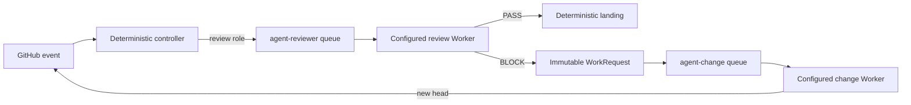

# Architecture

## Modules

### Automation Domain

This Module owns WorkRequest validation, exact revision identity, idempotency, review verdicts, repair postconditions, and landing eligibility. It contains no model-provider logic. Its Interface uses roles (`change` and `review`) rather than product names.

The WorkRequest is the durable Seam between roles. A producer ends after GitHub accepts the event. A consumer starts in a separate workflow run and independently revalidates the live pull request.

### Agent Worker

This Module owns the stable invocation and terminal receipt Interface. Its Depth comes from hiding provider sessions, process protocols, model configuration, and local UI persistence behind one small call. Controllers know a worker id and role; they do not know how the Implementation starts or observes a session.

### Agent Adapters

Adapters translate the Worker Interface to one runtime:

- `dsh-web` uses the local DeepSeek Harness Web Host.
- `codex-app` creates and observes a visible ChatGPT Desktop task.
- `command-json` supports any executable that accepts JSON stdin and returns a JSON receipt.

Adding an Adapter is local: the Automation Domain and target workflows do not change.

### Repository Gateway

Controller scripts validate and publish GitHub state using the host controller identity or the job-scoped Actions identity. Workers do not require individual GitHub accounts. Current change-role prompts may use the shared host transport to commit and publish; this is an Implementation detail of the trusted local change environment, not part of the Worker Interface.

### Role Runners

GitHub runner labels are the scheduling Interface. `agent-reviewer` and `agent-change` use different registrations, processes, work directories, concurrency groups, and task timeouts. They may run on different machines without controller changes.

## Event flow

There is no direct Agent-to-Agent call. GitHub records the handoff before the producing job terminates.

## Termination boundaries

- A Worker run terminates only with `completed`, `blocked`, `superseded`, `timed-out`, or `failed`.
- A controller accepts `completed` only after independently checking the role postcondition, such as a new pull request head, an exact-pair verdict, or an explicit same-head rereview request.
- Workflow and local process timeouts are finite. Cancellation does not become success.
- A review BLOCK terminates the review job after publishing a WorkRequest. It does not wait for change work.
- A stopped role runner leaves its matching GitHub job queued. Other runner labels continue to accept work.
- Landing terminates with merged, deferred for checks, stale revision, blocked, or failed. It never reuses a verdict from another base/head pair.

The remaining common failure domains are GitHub, the network, and any machine that hosts more than one runner. Moving a runner to another host changes only its labels and machine-local worker configuration.
